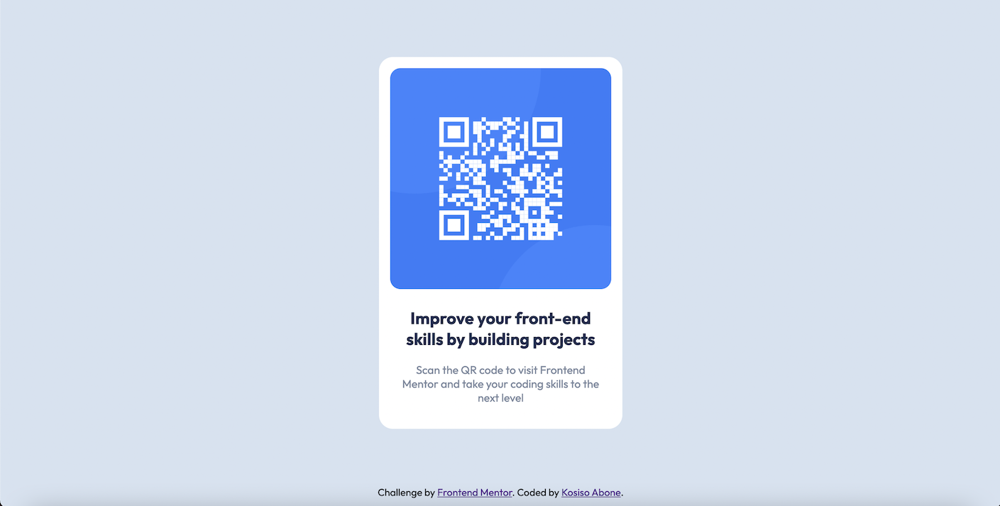
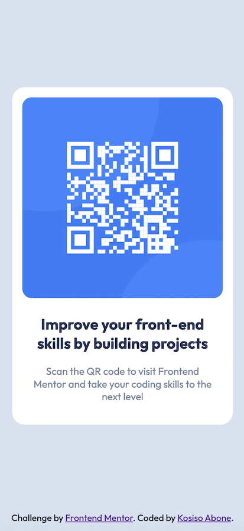

# Frontend Mentor - QR code component solution

This is a solution to the [QR code component challenge on Frontend Mentor](https://www.frontendmentor.io/challenges/qr-code-component-iux_sIO_H).

## Table of contents

- [Frontend Mentor - QR code component solution](#frontend-mentor---qr-code-component-solution)
  - [Table of contents](#table-of-contents)
  - [Overview](#overview)
    - [Screenshot](#screenshot)
    - [Links](#links)
  - [My process](#my-process)
    - [Built with](#built-with)
  - [Author](#author)

## Overview

### Screenshot

Add a screenshot of your solution. The easiest way to do this is to use Firefox to view your project, right-click the page and select "Take a Screenshot". You can choose either a full-height screenshot or a cropped one based on how long the page is. If it's very long, it might be best to crop it.

### Links

- Solution URL: [https://github.com/KosyAbone/qr-code-component](https://github.com/KosyAbone/qr-code-component)
- Live Site URL: [https://kosyabone.github.io/qr-code-component](https://kosyabone.github.io/qr-code-component)

## My process

- I used mobile-first workflow while designing.

### Built with

- Semantic HTML5 markup
- CSS custom properties
- Flexbox
- CSS Grid
- Mobile-first workflow

## Author

- Website - [Kosiso Abone](https://www.your-site.com)
- Frontend Mentor - [@KosyAbone](https://www.frontendmentor.io/profile/KosyAbone)
- Twitter - [@kosiso_harriet](https://www.twitter.com/kosiso_harriet)
- LinkedIn - [@kosiso-abone](https://linkedin.com/in/kosiso-abone)